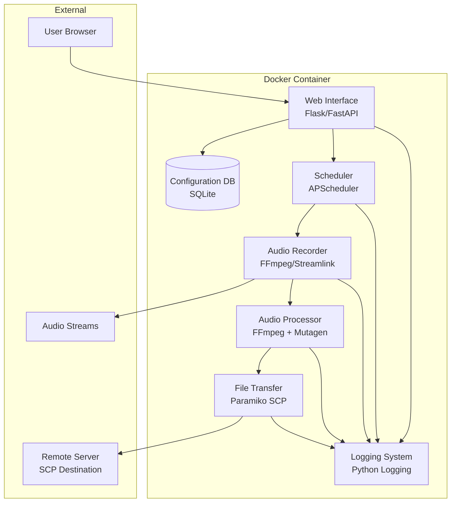

# Design Document

## Overview

The Audio Stream Recorder is a containerized Python application that provides automated recording, processing, and distribution of audio streams. The system consists of four main components: a web interface for configuration, a scheduler for automated recordings, an audio processing pipeline, and a file transfer system. The entire application runs in a Docker container with persistent storage for configurations and temporary recordings.

## Architecture

The system follows a modular architecture with clear separation of concerns:



## Components and Interfaces

### 1. Web Interface Component

**Technology Stack:**
- Flask or FastAPI for the web framework
- Jinja2 templates for server-side rendering
- Bootstrap or similar CSS framework for responsive UI
- SQLite for configuration storage

**Key Interfaces:**
- `StreamConfigurationAPI`: CRUD operations for stream configurations
- `ScheduleManagementAPI`: Create, update, delete recording schedules
- `SystemStatusAPI`: Real-time status and logging information
- `FileManagementAPI`: Upload artwork, manage output directories

**Core Functionality:**
- Dashboard showing all configured streams and their status
- Stream configuration forms with validation
- Schedule management with cron expression input
- Real-time logging and system status display
- Artwork upload and preview functionality (stored in persistent volume)
- Configuration backup and restore capabilities

### 2. Scheduler Component

**Technology Stack:**
- APScheduler (Advanced Python Scheduler) for cron-like scheduling
- Threading for concurrent job execution
- Job persistence to survive container restarts

**Key Interfaces:**
- `SchedulerService`: Main scheduling service interface
- `JobManager`: Create, update, delete scheduled jobs
- `RecordingTrigger`: Interface to start recording jobs

**Core Functionality:**
- Parse and validate cron expressions
- Schedule recurring recording jobs
- Handle job persistence and recovery
- Manage concurrent recording sessions
- Retry failed recordings based on configuration

### 3. Audio Recording Component

**Technology Stack:**
- FFmpeg for stream capture and audio processing
- Streamlink for handling various streaming protocols
- Python subprocess management for external tool integration

**Key Interfaces:**
- `StreamRecorder`: Main recording interface
- `StreamValidator`: Validate stream URLs and formats
- `RecordingSession`: Manage individual recording sessions

**Core Functionality:**
- Support multiple streaming protocols (HTTP/HTTPS, RTMP, etc.)
- Handle various audio formats (MP3, AAC, FLAC, WAV)
- Implement recording duration limits
- Provide real-time recording status
- Handle stream disconnections and reconnection logic

### 4. Audio Processing Component

**Technology Stack:**
- FFmpeg for audio format conversion
- Mutagen for MP3 metadata manipulation
- PIL/Pillow for artwork processing

**Key Interfaces:**
- `AudioProcessor`: Main processing interface
- `MetadataManager`: Handle MP3 tag operations
- `FormatConverter`: Convert between audio formats

**Core Functionality:**
- Convert audio files to MP3 format
- Calculate and apply metadata tags:
  - Title: Auto-generated as "YYYY-MM-DD Show"
  - Track number: Days since January 1, 2020
  - Artist, Album, Album Artist: User-configured
- Embed artwork into MP3 files
- Validate processed audio files

### 5. File Transfer Component

**Technology Stack:**
- Paramiko for SSH/SCP operations
- Retry logic with exponential backoff
- Secure key management

**Key Interfaces:**
- `SCPTransferService`: Main transfer interface
- `ConnectionManager`: Manage SSH connections
- `TransferQueue`: Queue and retry failed transfers

**Core Functionality:**
- Secure SCP file transfers
- SSH key-based authentication
- Configurable retry policies
- Transfer progress monitoring
- Optional local file cleanup after successful transfer

### 6. Configuration Management

**Technology Stack:**
- SQLite database for persistent storage (stored in host volume)
- SQLAlchemy ORM for database operations
- Pydantic for data validation
- File-based configuration backup system

**Key Interfaces:**
- `ConfigurationRepository`: Database access layer
- `StreamConfiguration`: Stream settings model
- `ScheduleConfiguration`: Recording schedule model
- `SystemConfiguration`: Global system settings
- `BackupManager`: Configuration backup and restore

**Persistence Strategy:**
- All configuration data stored in host-mounted volumes
- Database files persist across container restarts and updates
- Artwork files stored in dedicated persistent volume
- Automatic configuration backups to prevent data loss

## Data Models

### Stream Configuration Model
```python
class StreamConfiguration:
    id: int
    name: str
    stream_url: str
    artist: str
    album: str
    album_artist: str
    artwork_path: Optional[str]
    output_filename_pattern: str
    scp_destination: str
    created_at: datetime
    updated_at: datetime
```

### Recording Schedule Model
```python
class RecordingSchedule:
    id: int
    stream_config_id: int
    cron_expression: str
    duration_minutes: int
    is_active: bool
    next_run_time: datetime
    last_run_time: Optional[datetime]
    retry_count: int
    max_retries: int
    created_at: datetime
    updated_at: datetime
```

### Recording Session Model
```python
class RecordingSession:
    id: int
    schedule_id: int
    start_time: datetime
    end_time: Optional[datetime]
    status: RecordingStatus  # SCHEDULED, RECORDING, PROCESSING, COMPLETED, FAILED
    output_file_path: Optional[str]
    error_message: Optional[str]
    file_size_bytes: Optional[int]
    transfer_status: TransferStatus  # PENDING, IN_PROGRESS, COMPLETED, FAILED
```

## Error Handling

### Stream Connection Errors
- Implement exponential backoff for connection retries
- Log detailed error information including HTTP status codes
- Provide user-friendly error messages in the web interface
- Support fallback stream URLs if configured

### Audio Processing Errors
- Validate audio streams before processing
- Handle corrupted or incomplete recordings gracefully
- Provide detailed error logs for troubleshooting
- Implement file cleanup for failed processing attempts

### File Transfer Errors
- Queue failed transfers for retry
- Support multiple retry attempts with configurable delays
- Log transfer failures with detailed error information
- Maintain local files until successful transfer confirmation

### System Resource Errors
- Monitor disk space and memory usage
- Implement graceful degradation when resources are low
- Provide system health monitoring in the web interface
- Support automatic cleanup of old recordings and logs

## Testing Strategy

### Unit Testing
- Test individual components in isolation
- Mock external dependencies (FFmpeg, SCP connections)
- Validate data models and business logic
- Test error handling and edge cases

### Integration Testing
- Test component interactions
- Validate end-to-end recording workflows
- Test database operations and data persistence
- Verify web API functionality

### System Testing
- Test complete recording and transfer workflows
- Validate Docker container deployment
- Test system recovery after failures
- Performance testing with multiple concurrent recordings

### Manual Testing
- User interface testing across different browsers
- Stream compatibility testing with various sources
- Network failure and recovery testing
- Configuration validation and error handling

## Security Considerations

### SSH Key Management
- Store SSH private keys securely within the container
- Support key rotation without service interruption
- Validate SSH key formats and permissions
- Log security-related events

### Web Interface Security
- Implement input validation and sanitization
- Use CSRF protection for form submissions
- Secure file upload handling for artwork
- Rate limiting for API endpoints

### Network Security
- Run web interface on configurable ports
- Support HTTPS with SSL certificates
- Implement proper error handling to avoid information disclosure
- Validate and sanitize all user inputs

## Deployment Architecture

### Docker Container Structure
```dockerfile
# Base image with Python and system dependencies
FROM python:3.11-slim

# Install system dependencies (FFmpeg, SSH client)
RUN apt-get update && apt-get install -y \
    ffmpeg \
    openssh-client \
    && rm -rf /var/lib/apt/lists/*

# Application structure
WORKDIR /app
COPY requirements.txt .
RUN pip install -r requirements.txt

COPY src/ ./src/
COPY templates/ ./templates/
COPY static/ ./static/

# Volume mounts for persistence - all data stored outside container
VOLUME ["/app/data", "/app/recordings", "/app/config", "/app/logs", "/app/artwork"]

# Expose web interface port
EXPOSE 8666

# Start application services
CMD ["python", "src/main.py"]
```

### Volume Management
All persistent data is stored outside the container using volume mounts:
- `/app/data` → Host volume: SQLite database and application data
- `/app/recordings` → Host volume: Recorded audio files (persistent until transfer)
- `/app/config` → Host volume: Configuration files and SSH keys
- `/app/logs` → Host volume: Application logs
- `/app/artwork` → Host volume: User-uploaded artwork files

### Environment Configuration
- `WEB_PORT`: Web interface port (default: 8666)
- `LOG_LEVEL`: Logging verbosity (default: INFO)
- `MAX_CONCURRENT_RECORDINGS`: Concurrent recording limit (default: 3)
- `CLEANUP_AFTER_TRANSFER`: Delete local files after SCP (default: true)